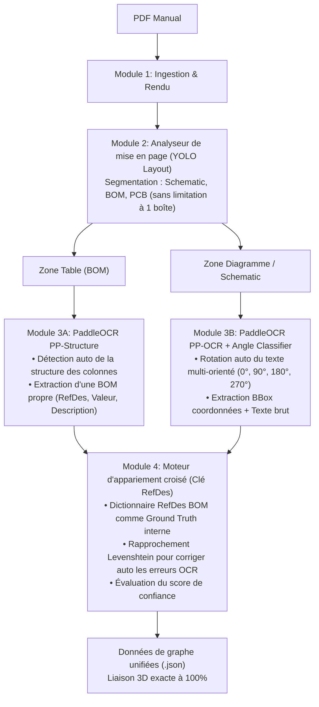

## 1. Contexte du problème

Les appareils audio vintage (amplificateurs, récepteurs, platines cassette des années 60 à 80 de marques réputées comme Marantz, Pioneer, Sansui, Sony, Revox) ont une grande valeur de collection et d'usage. Cependant, leur restauration et leur réparation se heurtent à un obstacle majeur lié à la documentation :

- **Documentation fragmentée** : Un manuel de service technique (*service manual*) comprend 3 sources d'informations distinctes :
  1. *Schéma de principe* (Schéma électronique théorique) : Contient les symboles de circuit, les identifiants de composants (R101, C205), les lignes de signaux et les tensions de référence.
  2. *Implantation des composants* (Plan physique d'implantation sur la carte) : Montre l'emplacement physique réel des composants sur la carte de circuit imprimé (PCB - côté composants ou côté cuivre / pistes).
  3. *Liste des composants / Parts List (BOM)* : Tableau répertoriant les références des composants, les caractéristiques techniques (ex. `2.2kΩ, 1/4W, 5% carbon film`), et les références pièces détachées du constructeur.
- **Difficulté pour le technicien** : Lorsqu'il constate une résistance brûlée ou un condensateur qui fuit, le technicien doit feuilleter dans tous les sens des dizaines de pages scannées et floues : trouver la référence du composant dans la nomenclature $\rightarrow$ trouver le symbole sur le schéma de principe pour vérifier les connexions $\rightarrow$ localiser la position physique sur le plan d'implantation du PCB pour y poser les pointes de touche du multimètre. C'est un véritable jeu de *"Où est Charlie"* qui prend des heures et est très propice aux erreurs.

---

## 2. Ce que le groupe de l'année dernière a réalisé et analyse de leur projet

- Le groupe de l'année dernière a réalisé un Proof of Concept (PoC) — c'est-à-dire qu'ils ont prouvé la faisabilité technique, mais ils n'ont pas totalement packagé le projet sous forme de produit. 
- Ils ont utilisé YOLO pour entraîner l'IA. Ils ont créé 2 modèles. Le premier a pour rôle, lorsqu'on lui fournit un fichier PDF, de savoir quelle est la page contenant le schéma théorique, quelle est la page du PCB et quelle est la page de la BOM. Le deuxième modèle est chargé de localiser les étiquettes de désignation des composants (`compo_name`) sur le schéma de principe et le PCB.
- **Points faibles :** 
  - J'ai examiné leur jeu de données : il y a au total 62 images utilisées pour entraîner l'IA (en réalité, seulement une vingtaine de pages originales sur lesquelles ils ont appliqué différentes techniques d'augmentation de données pour multiplier les images) -> selon moi, ce n'est pas un bon dataset.
  - Ils ont entraîné l'IA, mais ils ne sont pas en mesure de fournir des chiffres précis tels que le taux d'exactitude (précision), ni d'explications sur le réglage des hyperparamètres de l'IA.

> **--> Au vu de ce qui précède et des éléments décrits par le professeur dans la description du projet, je pense que les objectifs du projet cette année sont les suivants :**
> 1. Améliorer les points faibles de l'année dernière (je détaillerai plus loin comment les améliorer).
> 2. Nous devons finaliser 2 produits : au bureau et à l'atelier.

---

## 3. Objectifs fondamentaux de notre équipe cette année

En nous basant sur les réponses que le professeur m'a données lors de notre premier échange ainsi que sur les informations de la description du projet, l'objectif de l'équipe cette année n'est pas seulement de "faire tourner du code", mais de **construire un système complet, mesurable et réellement utilisable** :

1. **Corriger rigoureusement les limites du projet de l'année dernière :** Construire un nouveau jeu de données annoté de référence (ground truth) à partir de zéro ; faire monter en gamme le modèle de détection et intégrer un moteur d'OCR plus moderne.
2. **Définir les 2 applications cibles conformément aux exigences du projet :**
   - **Application "Au Bureau" (Préparation des dossiers) :** Extraction automatique des données depuis le PDF, avec une interface permettant l'intervention humaine (*Human-in-the-loop*) pour valider ou corriger rapidement les liaisons en cas de doute de l'IA.
   - **Application "À l'Atelier" (Usage des techniciens en atelier) :** Interface de consultation rapide (fonctionnant de manière fluide sur tablette/PC portable) : lorsque le technicien tape ou clique sur une référence de composant, le système zoome et met en évidence (highlight) simultanément son emplacement sur la BOM, le schéma de principe et le PCB.

---

## 4. Objectifs et critères de validation pour la soutenance mi-parcours (Soutenance Mi-parcours)

J'ai pris le temps de réfléchir aux objectifs du projet et aux différentes étapes. Il peut y avoir des manques, donc si vous souhaitez modifier quoi que ce soit, n'hésitez pas à en faire part à tout le groupe afin que nous puissions converger vers une conclusion commune. Ce sont les objectifs que j'ai définis à la suite des réponses du professeur lors de notre première réunion.

### Critères fixés pour la mi-parcours :
1. **Rapport d'analyse et de comparaison avec l'ancien code :** Mettre en évidence les erreurs du groupe de l'année dernière à l'aide de mesures expérimentales chiffrées (ou en les pointant directement dans le code).
2. **Jeu de données de référence (Ground Truth) :** Nous avons besoin d'un jeu de données de référence pour l'IA (tout comme l'humain doit d'abord apprendre à distinguer les chiffres avant de savoir calculer ; ce jeu de données de référence constitue la base de connaissances solide et exacte sur laquelle l'IA peut apprendre et se construire). À partir de ce jeu de données de référence, nous ferons progresser l'IA avec des chiffres et des mesures statistiques détaillées, ce qui rendra notre soutenance bien plus rigoureuse et convaincante.
3. **Modèle d'OCR intégré avec succès :** Idéalement, nous testerons plusieurs modèles d'OCR différents et fournirons des chiffres concrets pour les comparer, puis choisirons le meilleur modèle à intégrer. Sinon, nous prendrons le modèle le plus moderne actuellement (PaddleOCR).
4. **Prototype de démonstration interactif (Tri-Sync Prototype) :** L'utilisateur peut rechercher ou cliquer sur une référence de composant (ex. `R102`), et le système met immédiatement en surbrillance (highlight) et zoome simultanément sur les 3 vues.

*(Remarque : Les questions plus poussées concernant le packaging en 2 applications distinctes ou l'installeur Desktop seront étudiées et finalisées pour la soutenance finale).*

---

### Schéma d'architecture du pipeline de traitement (Architecture Flowchart)

---

### Système de benchmark (C'est-à-dire les paramètres évaluant si le modèle est bon ou mauvais en se basant sur des métriques de précision)
- Comme tu as noté "ne pas comprendre mon idée" lors de la question posée au professeur, nous réexaminerons ce point plus tard.

---

## 5. Les étapes de construction à partir de zéro :

### Étape 1 : Collecte des documents sources (Data Sourcing) - manuels de service (fichiers PDF)
- **Objectif :** Disposer de suffisamment de fichiers PDF pour le prétraitement des données.
- **Critères d'un fichier PDF standard :** Doit impérativement comporter les 3 parties :
  1. *Parts List / BOM* (Nomenclature des composants).
  2. *Schematic* (Schéma de principe / théorique).
  3. *PCB Layout* (Plan d'implantation des composants sur le circuit imprimé).
- **Travail concret :** Télécharger et stocker dans le dossier `data/raw_pdf/`.

### Étape 2 : Classification selon la résolution / qualité d'image des fichiers PDF : 
- Séparer en 2 dossiers : les fichiers ayant un DPI < 300 et ceux ayant un DPI > 300. 
- DPI > 300 sera utilisé pour entraîner l'IA ; DPI < 300 sera utilisé plus tard, pour tester le comportement sur des PDF de qualité dégradée.
- **Méthode :** Ouvrir le Terminal/CMD, exécuter la commande `pdfimages -list file.pdf` puis regarder les valeurs de DPI dans les deux colonnes `x-ppi` et `y-ppi`.

### Étape 3 : Préparation des données & Création du jeu de référence (Dataset & Ground Truth)
*À cette étape, nous préparons les données pour 2 tâches distinctes :*

1. **Données pour le Modèle 1 (Classification de pages - Page Classifier) :**
   - Pas besoin de tracer de boîtes englobantes (bounding boxes). 
   - Classer les images des pages dans 4 dossiers : `/bom`, `/schematic`, `/pcb`, `/other`.

2. **Données pour le Modèle 2 (Détection des repères de composants - Component Detector) :**
   - Importer les images de Schémas et de PCB sur **Roboflow**.
   - Annoter sur Roboflow : Tracer des rectangles entourant les désignations de composants (`R101`, `C205`, `Q701`...).

3. **Création du jeu de référence exact (Ground Truth - Obligatoire pour le benchmark) :**
   - Sélectionner 2 à 3 cartes modèles (au total environ 60 à 100 composants).
   - Établir 1 fichier JSON consignant l'emplacement exact à 100% de chaque composant : coordonnées de `R101` sur le Schéma, coordonnées sur le PCB, et spécifications dans la BOM.

* **Livrable de sortie :** Dataset sur Roboflow (déjà partitionné en 70% Train, 20% Val, 10% Test) + 1 fichier `ground_truth.json`.

### Étape 4 : Entraînement des modèles (YOLO)
- **Travail concret :**
  - Exécuter le script d'entraînement avec Ultralytics YOLO pour les 2 modèles définis à l'étape 3 :
    - Définir une taille d'image adaptée aux schémas techniques (`imgsz=1280` au lieu de 640 par défaut afin de ne pas dégrader les petits caractères).
    - Suivre les métriques clés : `mAP50`, `mAP50-95`, `Precision`, `Recall`.
    - Examiner les courbes d'entraînement (`results.png`) : vérifier si la perte (loss) décroît régulièrement et s'il n'y a pas de surapprentissage (overfitting).
    - Exporter le fichier de poids optimal : `best.pt`.
- **Livrable de sortie :** 2 fichiers de modèles `best.ptn` pour les deux tâches `page_classifier` et `component_detector`.

### Étape 5 : Intégration de la reconnaissance de texte (Moteur OCR - Text Extraction)
- **Objectif :** YOLO ne fait que tracer un cadre rectangulaire (il ne sait pas quel texte est écrit à l'intérieur). Cette étape extrait le contenu textuel sous forme de chaîne de caractères (`string`).
- **Nettoyage des résultats d'OCR :** Écrire une fonction Regex pour filtrer selon les conventions des composants électroniques (ex. : la première lettre doit être $R, C, Q, D, L, IC, T$ suivie de chiffres).
- En cas d'erreur de lecture de l'OCR, de mauvaise détection de zone par le modèle, etc., nous devrons nous réunir pour décider de la démarche à suivre.
- **Livrable de sortie :** Script produisant la liste des composants avec leurs coordonnées : `[{"text": "R102", "bbox": [x1, y1, x2, y2], "confidence": 0.95}, ...]`.

### Étape 6 : Appariement et liaison des données 3D (Cross-Matching Engine)
- **Objectif :** Relier les pièces du puzzle : lorsqu'un composant R102 est identifié dans la BOM, sur le Schéma et sur le PCB, le système doit les relier en une entité unique.
- **Travail concret :**
  - Lire la table BOM (avec `pdfplumber` ou `PaddleOCR PP-Structure` pour la reconnaissance de tableau) pour créer l'annuaire de référence des composants.
  - Utiliser un algorithme de comparaison floue de chaînes (Fuzzy String Matching / Distance de Levenshtein) :
    - *Exemple :* Si l'OCR lit par erreur R101 en R10I (la lettre I au lieu du chiffre 1), l'algorithme compare avec l'annuaire BOM et corrige automatiquement en R101.
  - Associer les coordonnées d'un même composant entre le Schéma et le PCB.
- **Livrable de sortie :** Fichier de données central `unified_mapping.json` (contenant l'ensemble des liaisons BOM - Schéma - PCB).

### Étape 7 : Réalisation de la démonstration
- Pas encore d'idée

### Étape 8 : Évaluation par benchmark & Analyse d'erreurs
- Disposer de données chiffrées réelles pour le rapport, prouvant que l'équipe de cette année fait un travail bien plus rigoureux que celle de l'année dernière. Les indicateurs détaillés et les métriques précises seront évalués ultérieurement.